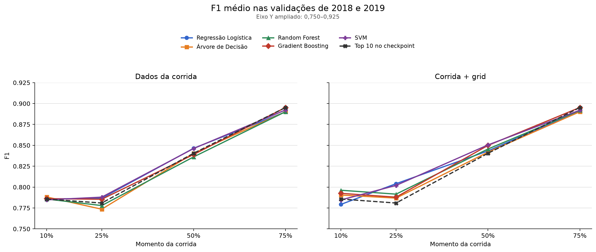
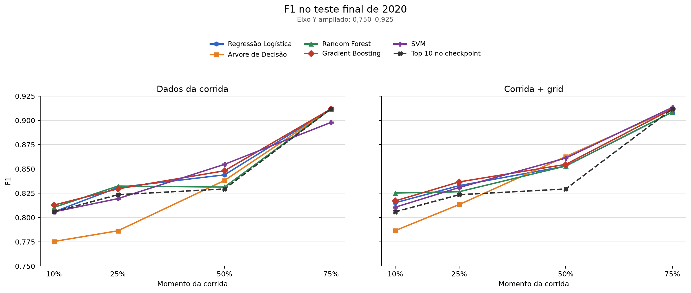
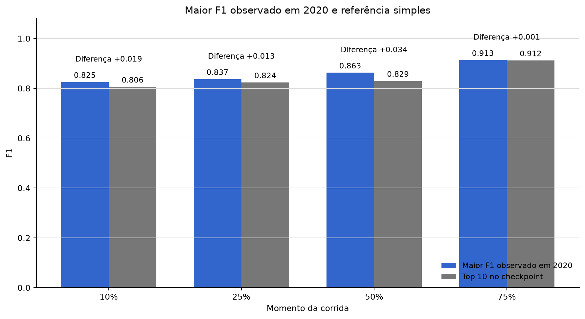
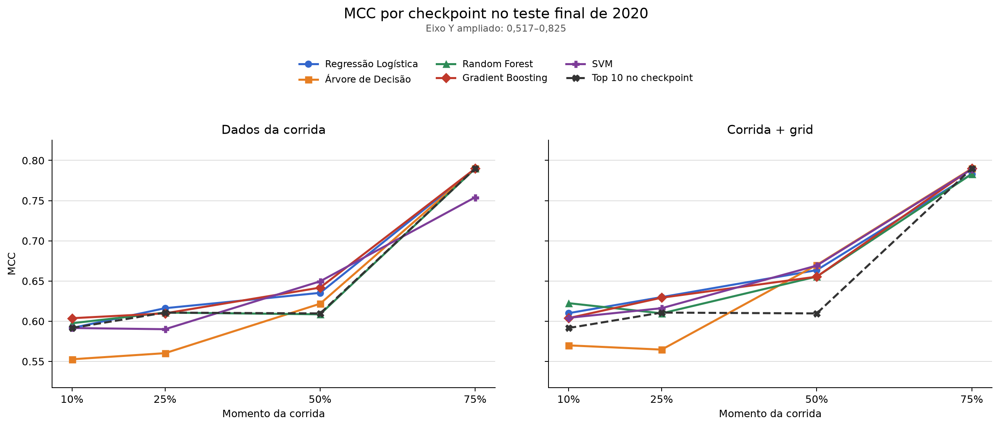
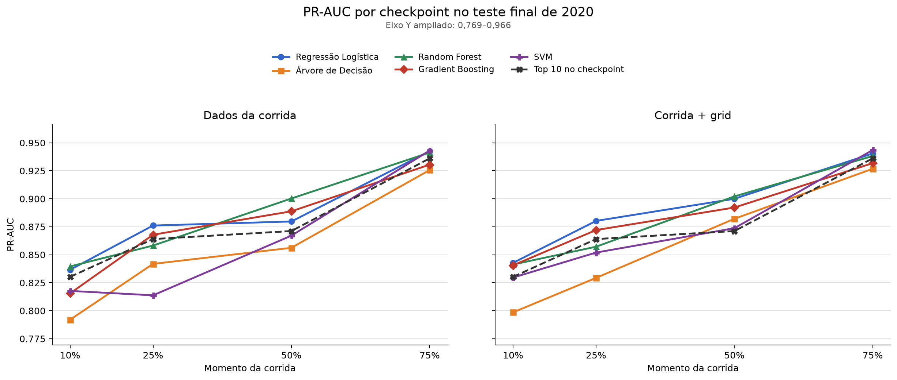
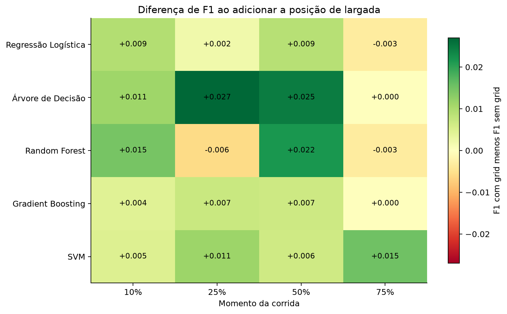
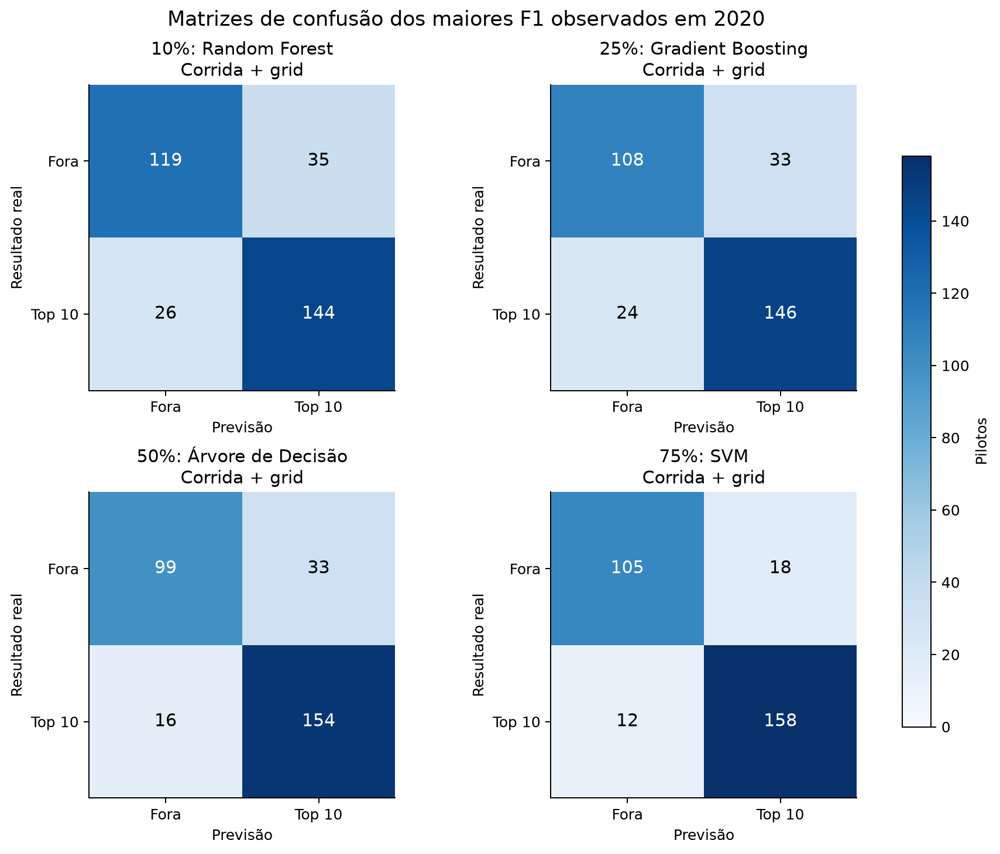
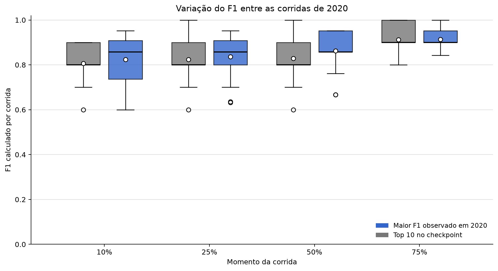

# Análise dos resultados dos classificadores

Relatório gerado automaticamente em 23/09/2026 22:31:12 -03.

## Escopo

Esta análise usa as melhores configurações definidas nas validações de 2018 e
2019 e os resultados obtidos no teste final de 2020. O script não treina nem
reconfigura os modelos. O maior resultado de 2020 é apresentado de maneira
descritiva e não é usado para alterar as configurações escolhidas anteriormente.

Todos os arquivos possuem o mesmo protocolo e a mesma assinatura da base. As
métricas do teste final foram recalculadas a partir das previsões individuais e
coincidiram com a avaliação consolidada. As matrizes de confusão também
coincidiram com as contagens presentes na avaliação final.

## Validação temporal

A tabela apresenta os cinco algoritmos. Para cada um, mostra o checkpoint e o
conjunto de atributos em que ele obteve seu maior F1 médio nas validações. Cada
linha usa uma configuração escolhida sem consultar 2020.

| Checkpoint | Algoritmo | Atributos | F1 2018 | F1 2019 | F1 médio | Diferença |
| --- | --- | --- | --- | --- | --- | --- |
| 75 | Regressão Logística | Corrida + grid | 0,893 | 0,890 | 0,892 | 0,002 |
| 75 | Árvore de Decisão | Dados da corrida | 0,900 | 0,880 | 0,890 | 0,020 |
| 75 | Random Forest | Corrida + grid | 0,893 | 0,890 | 0,892 | 0,003 |
| 75 | Gradient Boosting | Dados da corrida | 0,900 | 0,890 | 0,895 | 0,010 |
| 75 | SVM | Dados da corrida | 0,893 | 0,892 | 0,892 | 0,002 |

O gráfico mantém separados os modelos que usam apenas informações da corrida e
os que também usam a posição de largada. A linha tracejada representa a regra
simples de considerar que o top 10 no checkpoint permanecerá no top 10 final.

## Teste final de 2020

A tabela apresenta uma linha para cada algoritmo. O resultado mostrado é o
maior F1 observado para aquele algoritmo em 2020, acompanhado do checkpoint, do
conjunto de atributos e das demais métricas da mesma avaliação.

| Checkpoint | Algoritmo | Atributos | Acurácia | Precisão | Recall | F1 | F1 referência | Diferença |
| --- | --- | --- | --- | --- | --- | --- | --- | --- |
| 75 | Regressão Logística | Dados da corrida | 0,898 | 0,912 | 0,912 | 0,912 | 0,912 | 0,000 |
| 75 | Árvore de Decisão | Dados da corrida | 0,898 | 0,912 | 0,912 | 0,912 | 0,912 | 0,000 |
| 75 | Random Forest | Dados da corrida | 0,898 | 0,912 | 0,912 | 0,912 | 0,912 | 0,000 |
| 75 | Gradient Boosting | Dados da corrida | 0,898 | 0,912 | 0,912 | 0,912 | 0,912 | 0,000 |
| 75 | SVM | Corrida + grid | 0,898 | 0,898 | 0,929 | 0,913 | 0,912 | 0,001 |

O maior F1 observado cresceu em todos os checkpoints analisados. O maior valor foi 0,913, aos
75% da corrida, obtido por
SVM com corrida + grid.

O maior ganho sobre a referência simples, considerando os valores exibidos com
três casas decimais, foi de
0,034 no checkpoint de
50%.

Os maiores F1 observados na validação e no teste final apontaram para a mesma
combinação de algoritmo e atributos em 1 dos 4
checkpoints. Diferenças entre essas etapas são esperadas porque as temporadas
avaliadas não são as mesmas.

## Métricas complementares

As tabelas abaixo usam os mesmos cenários escolhidos pelo maior F1 de cada
algoritmo. MCC e PR-AUC não foram usados para trocar configurações.

### Validações de 2018 e 2019

| Checkpoint | Algoritmo | Atributos | MCC médio | PR-AUC média |
| --- | --- | --- | --- | --- |
| 75 | Regressão Logística | Corrida + grid | 0,749 | 0,927 |
| 75 | Árvore de Decisão | Dados da corrida | 0,747 | 0,901 |
| 75 | Random Forest | Corrida + grid | 0,749 | 0,918 |
| 75 | Gradient Boosting | Dados da corrida | 0,758 | 0,907 |
| 75 | SVM | Dados da corrida | 0,753 | 0,883 |

### Teste final de 2020

| Checkpoint | Algoritmo | Atributos | MCC | PR-AUC |
| --- | --- | --- | --- | --- |
| 75 | Regressão Logística | Dados da corrida | 0,790 | 0,943 |
| 75 | Árvore de Decisão | Dados da corrida | 0,790 | 0,926 |
| 75 | Random Forest | Dados da corrida | 0,790 | 0,941 |
| 75 | Gradient Boosting | Dados da corrida | 0,790 | 0,930 |
| 75 | SVM | Corrida + grid | 0,789 | 0,944 |

Os dois gráficos apresentam todos os checkpoints, os cinco algoritmos e a
referência simples. Os painéis mantêm separados os modelos que usam somente os
dados da corrida e os que também usam a posição de largada.

O MCC avalia conjuntamente os quatro tipos de resultado da matriz de confusão.
A PR-AUC, calculada como Average Precision, avalia a ordenação produzida pelo
escore de top 10 em diferentes limites de decisão.

## Efeito da posição de largada

### Validações de 2018 e 2019

Na média das duas validações, usar somente informações da corrida superou
corrida mais grid em 4 das 20
comparações:

| Checkpoint | Algoritmo | F1 corrida | F1 corrida + grid | Vantagem |
| --- | --- | --- | --- | --- |
| 10 | Regressão Logística | 0,786 | 0,779 | 0,006377 |
| 10 | SVM | 0,785 | 0,785 | 0,000094 |
| 50 | Regressão Logística | 0,846 | 0,843 | 0,003128 |
| 75 | SVM | 0,892 | 0,892 | 0,000276 |

Corrida mais grid foi melhor em 14 comparações e houve
empate em 2. Em 2 dos casos
favoráveis à base sem grid, a vantagem foi inferior a 0,001. Diferenças tão
pequenas devem ser interpretadas como resultados praticamente equivalentes.

### Teste final de 2020

Adicionar as informações do grid aumentou o F1 em 15 das
20 comparações, manteve o resultado em 2 e reduziu em
3. A diferença média foi 0,008. Esses valores
descrevem associação preditiva. Eles não demonstram que a posição de largada
causa o resultado final.

## Erros dos modelos

Cada matriz separa quatro situações: acertos fora do top 10, falsos positivos,
falsos negativos e acertos no top 10. Falso positivo significa prever top 10
para um piloto que terminou fora. Falso negativo significa deixar fora da
previsão um piloto que terminou no top 10.

## Variação entre corridas

| Checkpoint | Série | Corridas | Média | Mediana | Mínimo | Máximo |
| --- | --- | --- | --- | --- | --- | --- |
| 10 | Maior F1 observado | 17 | 0,824 | 0,857 | 0,600 | 0,952 |
| 10 | Referência | 17 | 0,806 | 0,800 | 0,600 | 0,900 |
| 25 | Maior F1 observado | 17 | 0,836 | 0,857 | 0,632 | 0,952 |
| 25 | Referência | 17 | 0,824 | 0,800 | 0,600 | 1,000 |
| 50 | Maior F1 observado | 17 | 0,863 | 0,857 | 0,667 | 0,952 |
| 50 | Referência | 17 | 0,829 | 0,800 | 0,600 | 1,000 |
| 75 | Maior F1 observado | 17 | 0,913 | 0,900 | 0,842 | 1,000 |
| 75 | Referência | 17 | 0,912 | 0,900 | 0,800 | 1,000 |

As métricas consolidadas juntam todas as previsões de 2020. O gráfico por
corrida mostra que o desempenho não foi idêntico em todos os eventos. A linha
central de cada caixa é a mediana, e o ponto branco representa a média.

## Resposta à pergunta de pesquisa

Os resultados permitem comparar quanto a previsão melhora entre 10%, 25%, 50%
e 75% da corrida. O checkpoint com maior F1 observado em 2020 foi o de
75%. Entretanto, a metodologia ainda não
definiu um valor mínimo de F1 que signifique “confiável”. Portanto, o relatório
identifica o momento de melhor desempenho e a evolução das métricas, mas não
declara automaticamente o primeiro checkpoint confiável.

## Significado das métricas

- **Acurácia:** proporção de todas as previsões que estavam corretas.
- **Precisão:** entre os pilotos previstos no top 10, quantos realmente terminaram nele.
- **Recall:** entre os pilotos que terminaram no top 10, quantos foram encontrados pelo modelo.
- **F1:** equilíbrio entre precisão e recall. É a principal métrica desta análise.
- **MCC:** resume os quatro componentes da matriz de confusão; varia de -1 a 1.
- **PR-AUC:** resume a curva precisão-recall construída com `top10_score`; quanto maior, melhor a ordenação dos pilotos.

## Limitações para a interpretação

- O teste final contém somente a temporada de 2020.
- Pilotos da mesma corrida não devem ser tratados como observações totalmente independentes.
- Destacar o maior resultado de 2020 é uma comparação descritiva, não uma nova seleção de modelo.
- A classificação é feita por piloto e não obriga cada modelo a prever exatamente dez pilotos no top 10.
- Diferenças pequenas de F1 devem ser interpretadas com cautela, principalmente sem intervalo de confiança.
- `top10_score` é um escore de ordenação. Ele só representa probabilidade nos classificadores que oferecem `predict_proba`; no SVM é a função de decisão.
